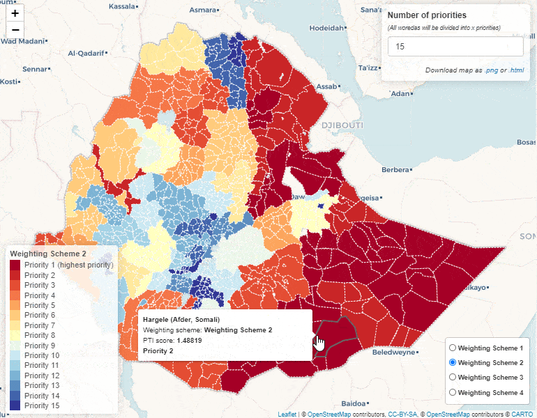
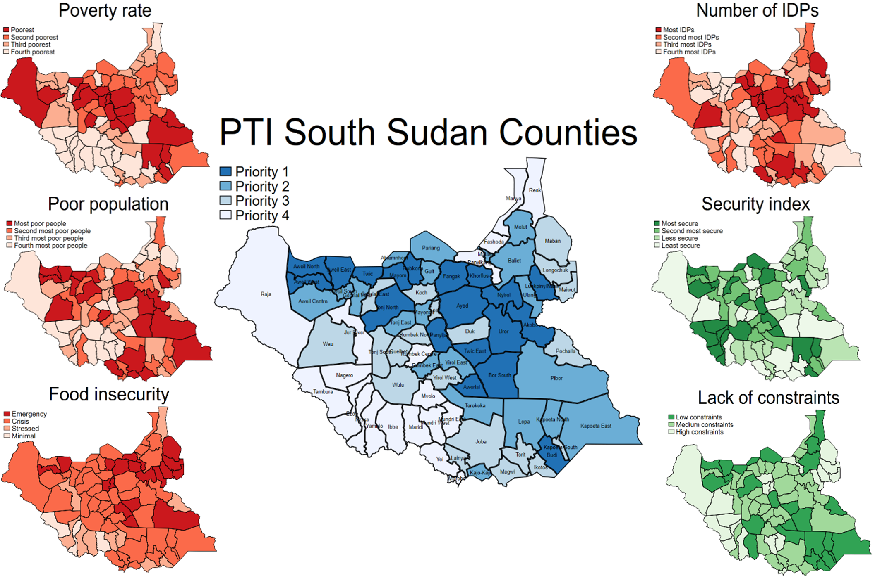
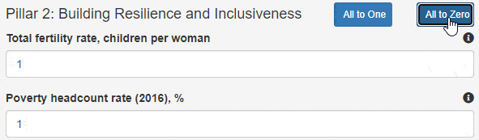
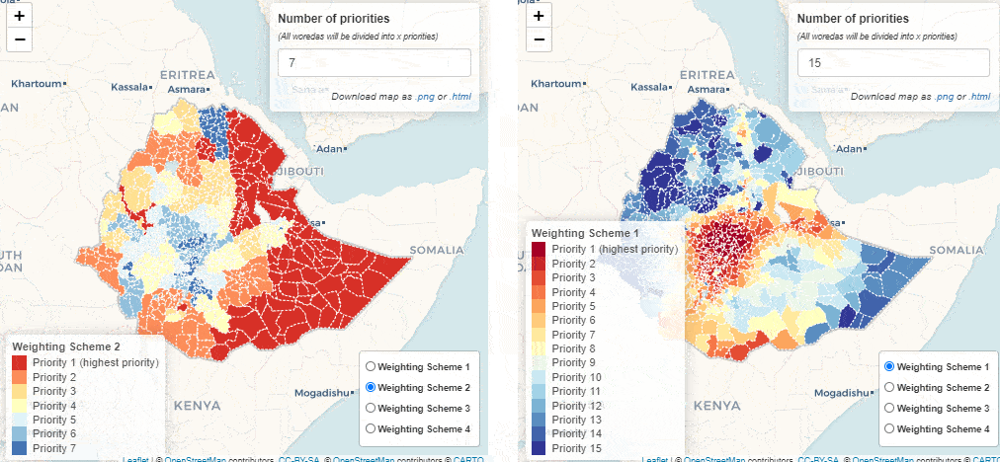
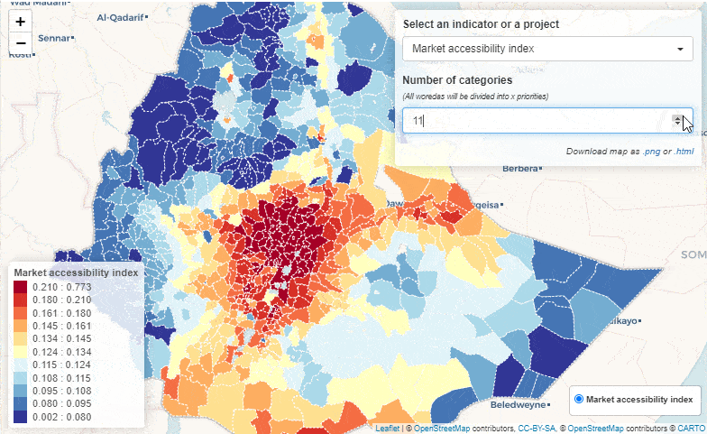

<!--
  Self-standing slide deck built from the `build-pti-*` tutorial series.
  Filename is `_`-prefixed so pkgdown ignores it (kept off the website);
  vignettes/articles is .Rbuildignore'd so R CMD check is unaffected.

  Dual-format. Render BOTH with:
    quarto render vignettes/articles/_build-pti-slides.qmd
  or one at a time:
    quarto render ... --to revealjs   # HTML, animated app GIFs, self-contained
    quarto render ... --to beamer     # PDF, static PNG stills of the same demos

  Images are format-switched via .content-visible (GIF for HTML, PNG for PDF) —
  GIFs cannot be embedded in a pdflatex PDF. Body text is kept ASCII-safe
  ("->" not unicode arrows) so the same source compiles under pdflatex.
  Code blocks are display-only (```r, not ```{r}); no R is needed to build.
-->

## What is a PTI?

::::: {.columns}

:::: {.column width="50%"}
A **Project Targeting Index** ranks
sub-national units against
**weighted indicators** --- to guide
where programs and money go.

`devPTIpack` turns three inputs:

- **shapes** --- boundaries
- **metadata** --- indicators
- *(optional)* **hex** --- H3 grid

...into a deployed Shiny dashboard.
::::

:::: {.column width="50%"}
::: {.content-visible when-format="revealjs"}
{fig-alt="Animated screen recording of the interactive PTI choropleth map" width="100%"}
:::
::: {.content-visible when-format="beamer"}
{fig-alt="Screenshot of the PTI choropleth map" width="100%"}
:::
::::

:::::

## How the score is computed {.smaller}

::::: {.columns}

:::: {.column width="58%"}
1. **Normalize** each indicator to a z-score (mean 0, sd 1) *within* its admin
   level --- a region's standing vs. its true peers.

2. **Weight & sum** the standardized indicators into one composite per
   targeting priority $p$:

$$PTI_p = \sum_{j=1}^{n} x_{ij}^{*}\, w_j$$

3. **Rank** regions, split into 3--5 equal priority classes (quantiles).
   Priority 1 = highest need.
::::

:::: {.column width="42%"}
{fig-alt="Choropleth map of Sudan shaded by PTI priority class" width="100%"}
::::

:::::

Weights are **interactive** --- users re-weight live in the app and the map re-ranks.

## The seven-step pipeline

| \# | Step | Output in `app-data/` |
|:--:|------------------|-----------------------------|
| 0 | Setup | scaffolded project |
| 1 | Shapefiles | `shapes.rds` |
| 2 | Zonal stats *(opt.)* | raster-derived columns |
| 3 | Metadata | `metadata-user.xlsx` |
| 4 | Hex data *(opt.)* | `metadata-hex.xlsx` |
| 5 | Compile | `metadata.xlsx` + `.zip` + `.pdf` |
| 6 | Deploy | live app |

Steps 1, 3, 5 are mandatory. `00-master.R` runs them top-to-bottom.

## Quick start --- Rwanda in five lines

The bundled template *is* a working app:

```r
pak::pak("worldbank/devPTIpack")
library(devPTIpack)

create_new_pti("~/projects/rwa_pti")        # scaffold
source("~/projects/rwa_pti/00-master.R")    # Steps 1 + 3 + 5
shiny::runApp("~/projects/rwa_pti/app.R")   # launch locally
```

5 provinces, 30 districts, 3 indicators, 2 pillars.
Swap in your country, re-run the same pipeline.

# Step 0 --- Setup

## Install & scaffold

```r
# 1) the package (GitHub-hosted)
install.packages("pak")
pak::pak("worldbank/devPTIpack")

# 2) LaTeX -- only for the Step 5 atlas PDF
install.packages("tinytex"); tinytex::install_tinytex()

# 3) scaffold a project (copies the bundled template)
create_new_pti("~/projects/my_pti")
```

`create_new_pti()` drops a complete, runnable Rwanda app on disk ---
render it as-is first, then replace the inputs with your own.

## Project layout {.smaller}

```text
my_pti/
|- 00-master.R       # orchestrator: renders Steps 1, 3, 5
|- 01-shapes.qmd     # Step 1
|- 03-metadata.qmd   # Step 3
|- 05-compile.qmd    # Step 5
|- 06-deploy.R       # Step 6 (manual)
|- app.R             # <- DEPLOYED
|- landing-page.md   # <- DEPLOYED
|- sample-data/      # raw inputs (replace with yours)
\- app-data/         # pipeline outputs   <- DEPLOYED
```

Deploy bundle = **`app.R` + `landing-page.md` + `app-data/`**.
Everything else is build-time scaffolding.

# Step 1 --- Administrative boundaries

## The target: `app-data/shapes.rds`

A **named list of `sf` tibbles**, one per admin level
(`admin0_Country`, `admin1_Province`, ...).

| Column | Rule |
|----------------|----------------------------------------|
| `admin<N>Pcod` | unique P-code, no `NA` |
| `admin<N>Name` | unique name, no `NA` |
| `area` | numeric, sq. km, computed in EPSG:4326 |
| `geometry` | (MULTI)POLYGON, **EPSG:4326** |

`admin0_Country` is mandatory. Sub-levels also carry every parent's
`admin<k>Pcod` --- the *cascade rule*.

## Load & conform to the convention {.smaller}

```r
library(sf); library(dplyr); library(devPTIpack)

adm1 <- read_sf("sample-data/rwa_adm1.geojson") |>
  st_transform(4326) |>                       # always EPSG:4326
  mutate(
    admin0Pcod = "RWA",
    admin1Pcod = shapeID,                      # rename to convention
    admin1Name = shapeName,
    area = as.numeric(units::set_units(st_area(geometry), "km^2"))
  ) |>
  select(admin0Pcod, admin1Pcod, admin1Name, area, geometry)

my_shp <- list(admin0_Country = adm0, admin1_Province = adm1)
```

## Validate --- catch problems early {.smaller}

```r
validate_geometries(my_shp)   # pass / warn / fail + structured issues
```

Catches duplicate P-codes, wrong geometry type, parent/child orphans,
missing columns, cascade failures.

It does **not** check CRS mismatch between layers, `area` units,
topology, or coverage gaps --- audit those yourself:

```r
purrr::map(my_shp, sf::st_crs)        # CRS audit across layers
sf::st_is_valid(my_shp$admin1_Province)
app_validate_shp(my_shp)              # interactive leaflet inspector
```

## Fix, then save {.smaller}

```r
adm1 <- adm1 |>
  st_transform(4326) |>                  # no-op if already correct
  st_make_valid() |>                     # fix self-intersections, slivers
  st_simplify(dTolerance = 0.001,        # trade file size vs. detail
              preserveTopology = TRUE) |>
  select(admin0Pcod, admin1Pcod, admin1Name, area, geometry)

# re-run validate_geometries() until clean, then:
dir.create("app-data", showWarnings = FALSE)
saveRDS(my_shp, "app-data/shapes.rds", compress = "gz")
```

Keep raw GeoJSON as source-of-truth; `shapes.rds` is regenerable.

## Multi-level & the hex grid {.smaller}

**Cascade** --- fill every parent P-code by centroid-in-polygon join:

```r
my_shp <- make_admin_lookup(my_shp)   # adm2 gains admin1Pcod, admin0Pcod
```

**Hex grid** --- uniform H3 cells for raster-only indicators:

```r
HEX_RESOLUTION <- 6L                   # set ONCE in 00-master.R
my_shp$admin9_Hexagon <- make_hex_grid(adm0, resolution = HEX_RESOLUTION)
my_shp <- make_admin_lookup(my_shp)    # hexes treated like any layer
```

| res | cell area | typical use |
|:--:|------------|--------------------------|
| 5 | ~252 sq.km | very large countries |
| 6 | ~36 sq.km | most apps (default) |
| 7 | ~5 sq.km | small / high-detail |

# Step 2 --- Zonal stats (optional)

## Raster -> polygon values {.smaller}

When an indicator exists only as a raster (population, night lights,
travel time), aggregate it to polygons. Load shapes from **Step 1's
output** so keys join cleanly.

```r
library(exactextractr)
my_shp <- readRDS("app-data/shapes.rds")
adm2   <- my_shp$admin2_District

r <- terra::rast("path/to/raster.tif")
adm2$mean_value <- exact_extract(r, adm2, fun = "mean")

adm2 |>
  sf::st_drop_geometry() |>
  dplyr::transmute(admin2Pcod, my_indicator = mean_value) |>
  writexl::write_xlsx("sample-data/my-zonal-stats-adm2.xlsx")
```

The output feeds an `admin<N>_<Name>` sheet in Step 3.

# Step 3 --- Metadata workbook

## The metadata workbook

One round-trippable `.xlsx` = values + descriptions.

| Sheet | Required | Holds |
|--------------------|:--------:|---------------------------------|
| `general` | yes | one row: `country` |
| `metadata` | yes | indicator catalogue (14 cols) |
| `admin<N>_<Name>` | 1+ | wide values, one col per indicator |
| `weights_table` | opt. | pre-defined weighting schemes |

The admin-sheet name is a **foreign key**: `admin1_Province` here must
equal the slot in `shapes.rds`. Mismatches drop indicators *silently*.

## The `metadata` sheet --- key columns {.smaller}

| Column | Purpose |
|------------------------------|--------------------------------|
| `var_code` | indicator's column name (no `:`) |
| `var_name` | display name (no `:`) |
| `spatial_level` | finest `admin<N>_<Name>` it appears on |
| `pillar_group` / `pillar_name` | group indicators into pillars |
| `fltr_exclude_pti` | `TRUE` to drop from the PTI |
| `legend_revert_colours` | `TRUE` when high = bad (e.g. poverty) |

Booleans must be **logical**, not strings. A `:` anywhere breaks parsing.

## Read, validate, save {.smaller}

```r
inp_dta <- fct_template_reader("sample-data/sample-metadata-adm1.xlsx")
names(inp_dta)
#> "general" "metadata" "admin1_Province" "weights_clean"

# structural checks + a dry-run of the full PTI calc under equal weights
validate_metadata(shp_path  = "app-data/shapes.rds",
                  mtdt_path = "sample-data/sample-metadata-adm1.xlsx")

app_validate_metadata(shp_dta = readRDS("app-data/shapes.rds"),
                      inp_dta = inp_dta)   # visual Data Explorer

file.copy("sample-data/sample-metadata-adm1.xlsx",
          "app-data/metadata-user.xlsx", overwrite = TRUE)
```

# Step 4 --- Hex data (optional)

## Pipeline & two switches

Four stages, driven by two knobs in `00-master.R`:

```r
HEX_RESOLUTION     <- 6L      # H3 resolution; auto-detected downstream
INCLUDE_HEX_IN_APP <- FALSE   # ship raw hex sheet? aggregates always ship
```

discover -> configure -> **fetch** -> aggregate -> build Excel

Order-flexible: runs before *or* after Step 3; the outputs are
independent intermediates that Step 5 merges.

## Discover, fetch, aggregate {.smaller}

```r
list_hex_vars()                       # the registry catalogue
get_available_years("flood_exposure_15cm_1in100")

vars <- use_hex_vars("flood_exposure_15cm_1in100", years = 2020)

hex_data <- fetch_hex_data(hex_ids = hex_layer$admin9Pcod, vars = vars)

aggregated <- aggregate_hex_to_shapes(
  hex_data, hex_layer, shp_dta = my_shp,
  strategy = list(.default = c(weight = "pop", fun = "mean"))
)
```

`weight`: pop, area, none. `fun`: mean, median, sum, min, max.

## Build `metadata-hex.xlsx` {.smaller}

```r
build_hex_metadata(
  aggregated, shp_dta = my_shp,
  country_name = "Rwanda",
  output_path  = "app-data/metadata-hex.xlsx",
  include_hex  = INCLUDE_HEX_IN_APP,
  # registry vars auto-fill name/units/pillar/flags;
  # pass indicator_config only for non-registry vars:
  indicator_config = tibble::tibble(
    canonical_name = "conflict",
    var_name       = "Conflict Events ({year})",
    pillar_name    = "Security", fltr_exclude_pti = FALSE
  )
)
```

Review `fltr_exclude_pti` before Step 5. Population weights the
aggregation but is excluded from the sheet by default.

# Step 5 --- Compile & finalise

## `compile_pti_data()` --- merge, validate, emit {.smaller}

```r
result <- compile_pti_data(
  shp_path       = "app-data/shapes.rds",
  metadata_paths = c("app-data/metadata-user.xlsx"
                     # , "app-data/metadata-hex.xlsx"  # add when Step 4 ran
                     ),
  output_dir     = "app-data"
)
```

| Output | What it is |
|--------------------|-----------------------------------------|
| `metadata.xlsx` | canonical merged workbook |
| `shapefiles.zip` | one GeoJSON per layer (download tab) |
| `pti-metadata.pdf` | indicator atlas (skipped if no LaTeX) |

Re-validates after merge; aborts on `fail`. Use `error_on_fail = FALSE`
to inspect issues instead of crashing.

## Launch locally {.smaller}

```r
launch_pti(
  shp_dta  = readRDS("app-data/shapes.rds"),
  inp_dta  = fct_template_reader("app-data/metadata.xlsx"),
  app_name = "Rwanda PTI"
)
```

| Tab | Shows |
|:---------:|------------------------------------------|
| Info | renders `landing-page.md` |
| PTI | composite-index map; weight sliders |
| Compare | two weighting schemes, side-by-side |
| Explorer | per-indicator choropleth + table |

Click every tab: popups, downloads, and slider re-render should all work.

# Inside the dashboard

## PTI tab --- weights drive the map

::: {.content-visible when-format="revealjs"}
{fig-alt="Animated demo of adjusting indicator weight sliders and the PTI map re-ranking" width="78%"}
:::
::: {.content-visible when-format="beamer"}
{fig-alt="Screenshot of the indicator weight sliders panel" width="92%"}
:::

## Compare & Explore

::::: {.columns}

:::: {.column width="50%"}
**Compare** two weighting schemes

::: {.content-visible when-format="revealjs"}
{fig-alt="Animated demo of two PTI maps shown side by side for two weighting schemes" width="100%"}
:::
::: {.content-visible when-format="beamer"}
{fig-alt="Screenshot of two PTI maps side by side" width="100%"}
:::
::::

:::: {.column width="50%"}
**Explore** raw indicators

::: {.content-visible when-format="revealjs"}
{fig-alt="Animated demo of the per-indicator data explorer with choropleth and table" width="100%"}
:::
::: {.content-visible when-format="beamer"}
{fig-alt="Screenshot of the per-indicator data explorer" width="100%"}
:::
::::

:::::

# Step 6 --- Deploy

## What ships, and where {.smaller}

Bundle = **`app.R` + `landing-page.md` + `app-data/`**. Nothing else.

| Target | Audience | Notes |
|------------------------------|:--------:|----------------------------|
| WB Posit Connect (internal) | WB staff | default; needs VPN + account |
| WB Posit Connect (external) | public | needs programme approval |
| shinyapps.io | public | fast path for demos |

Get publisher access from the GeoPov team; load an API key once with
`rsconnect::setAccountInfo()`.

## Deploy, then iterate {.smaller}

```r
rsconnect::deployApp(
  appDir   = ".",
  appFiles = c("app.R", "landing-page.md", "app-data"),  # the whitelist
  appName  = basename(getwd()),
  server   = NULL                 # your Connect server, or shinyapps.io
)
```

The everyday loop --- after editing raw inputs:

```r
source("00-master.R")             # regenerate app-data/ (Steps 1, 3, 5)
rsconnect::deployApp(...)          # updates the same URL in place
```

# Proven in the field

## Used across 30+ countries {.smaller}

::::: {.columns}

:::: {.column width="40%"}
**Sub-Saharan Africa**

Benin, Burundi, Cabo Verde, Cameroon, Côte d'Ivoire, DR Congo, Ethiopia,
The Gambia, Ghana, Guinea, Guinea-Bissau, Liberia, Madagascar, Mauritania,
Mozambique, Senegal, Sierra Leone, Somalia, South Sudan, Sudan, Tanzania,
Togo, Zambia --- plus *Sahel (regional)*
::::

:::: {.column width="30%"}
**MENA & South Asia**

Iraq, Morocco, Pakistan, Palestine, Yemen
::::

:::: {.column width="30%"}
**East Asia & Pacific**

Cambodia, Fiji, Papua New Guinea, Vanuatu --- plus *Pacific Islands (joint)*
::::

:::::

Live apps + data/app repos: see the **Past Projects** article and
[github.com/wbPTI](https://github.com/wbPTI).

## Recap & resources

The pipeline, end to end:

**shapes** + **metadata** (+ **hex**) -> `compile_pti_data()` -> `launch_pti()` -> **deploy**

- One command to operate: `source("00-master.R")`
- Tutorials: the `build-pti` article series (Steps 0--6)
- Reference: *Data preparation* and *PTI Methodology* articles
- Help: GitHub issues, GeoPov SharePoint, docs.posit.co/connect

::: {.notes}
Built from the build-pti-* tutorial series. Replace Rwanda sample data with your country and re-run.
:::
